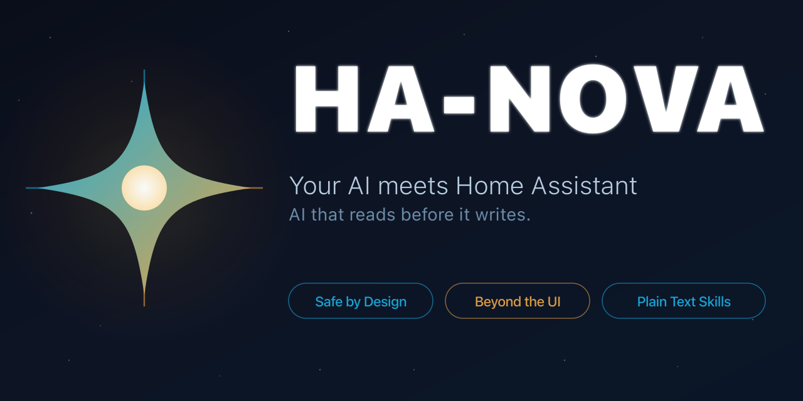

<p align="center">
  
</p>

<p align="center">
  <a href="https://github.com/markusleben/ha-nova/actions/workflows/ci.yml"></a>
  <a href="https://github.com/markusleben/ha-nova/blob/main/LICENSE"></a>
  = 20">
  
</p>

<p align="center">
  <b>Talk to your smart home. In plain language.</b><br>
  <sub>Not an MCP server. Not a chatbot. Skills that teach your AI how Home Assistant works.</sub>
</p>

---

## Why This Exists

I spent over a year building an MCP server for Home Assistant — hundreds of tool definitions, entity validation, config normalization. Thousands of lines of server code trying to teach an AI how Home Assistant works. ([Here's an early demo](https://youtu.be/ylak867RkzM) from when I was just getting started.)

I kept polishing it, adding features, chasing perfection — but never releasing it. Always "one more thing" before it's ready. By the time I looked up, others had shipped their MCP servers while mine was still sitting on my machine.

Then skills came along, and I realized the whole approach was wrong. Instead of coding domain knowledge into a server, I could write it as Markdown that the AI reads directly. No compilation, no deploy, no tool definitions. Just text files that teach the AI what to do.

I scrapped everything and started fresh. **HA NOVA is the result** — and it's a fundamentally better approach.

> **⚡ Early Access** — HA NOVA is young. The core works well, but you might hit rough edges. For anything critical, keep a backup of your configs before letting the AI make changes. Currently macOS only — Linux and Windows support is on the roadmap. If you run into issues or have ideas, [open an issue](https://github.com/markusleben/ha-nova/issues) or jump in and contribute. This is the perfect time to help shape the project.

## 💬 What Can You Do?

Just talk to your AI client. It knows how.

| You say | What happens |
|---------|-------------|
| *"Turn off the living room lights"* | Switches off the lights |
| *"List my automations"* | Shows all your automations |
| *"Create an automation that turns on the porch light at sunset"* | Builds it, shows you a preview, asks for OK, then applies |
| *"Why didn't my motion automation trigger last night?"* | Analyzes the trace logs and explains what went wrong |
| *"Show me all sensors in the bedroom"* | Finds entities by room |
| *"Set the thermostat to 21°C"* | Sets it and confirms the new state |

## 🔄 How Your AI Handles Automations

When you ask your AI to create or change an automation, it doesn't just write it blindly. It follows a careful process:

1. **Research** — Looks up your devices, checks existing automations, finds the right entities
2. **Preview** — Shows you exactly what it will create or change, and waits for your OK
3. **Apply & Verify** — Writes the config, reads it back to make sure it stuck
4. **Review** — Checks the result against best practices — are triggers reliable? Could something conflict with an existing automation?

Deleting an automation requires a special confirmation code — no accidental removals.

This means you can confidently say *"Create an automation that..."* and know the AI will guide you through it step by step.

## 🧠 How It Works

HA NOVA has two parts:

**A small relay** that runs on your Home Assistant as an App. It doesn't do anything smart — it just passes your AI's requests through to Home Assistant securely. Think of it as a locked door with a key.

**A set of skills** (plain text files) that teach your AI client how to operate Home Assistant. Your AI reads them, understands what to do, and talks to the relay.

That's it. The intelligence comes from your AI — the skills just give it the playbook.

> **Why not put all the logic into a server?**
>
> Because then every new feature means more server code, more bugs, more deployments. With skills, adding a new capability is just editing a text file. Your AI already understands Home Assistant — skills just teach it the specifics of *your* setup. No tool definitions, no schema updates, no release cycle.

> **Why a relay at all?**
>
> Two reasons: **security** and **speed**. The relay keeps your HA access token safely on the HA host (never on your machine). Auth tokens on your side are encrypted in macOS Keychain — never in config files, URLs, or logs. And the relay maintains a permanent connection so every request is fast — no reconnecting each time.

## 🚀 Quick Start

> **You need:** macOS, Node.js 20+, Home Assistant OS or Supervised

**One command to get started:**
```bash
curl -fsSL https://raw.githubusercontent.com/markusleben/ha-nova/main/install.sh | bash
```

The setup wizard asks which AI client you use, then handles the rest — installs the relay, configures tokens, sets up skills.

**Already have the repo?**
```bash
npx ha-nova setup
```

## 🤖 Supported AI Clients

| Client | Status | Type |
|--------|--------|------|
| [Claude Desktop](https://claude.com/download) (Code tab) | ✅ Supported | Desktop app |
| [Claude Code](https://github.com/anthropics/claude-code) | ✅ Supported | Terminal |
| [Codex CLI](https://github.com/openai/codex) | ✅ Supported | Terminal |
| [OpenCode](https://github.com/nicepkg/OpenCode) | ✅ Supported | Terminal |
| [Gemini CLI](https://github.com/google-gemini/gemini-cli) | ✅ Supported | Terminal |

> **Don't like terminals?** Claude Desktop is the easiest way to get started. It gives you a full graphical interface — same capabilities as the terminal, but with clickable buttons, visual diffs, and a chat-like experience. You just need a [Claude Pro, Max, or Team plan](https://claude.com/pricing).
>
> **How to set up:** Run the install command from [Quick Start](#-quick-start) and select **Claude Code** when asked. Claude Desktop's Code tab shares the same configuration, so the plugin works in both. Then open Claude Desktop, switch to the **Code** tab, and pick a folder on your Mac — for example create one called `SmartHome` on your Desktop. This folder is just a workspace for your AI. You don't need to put anything in it — just select it and start talking.

## 📖 What Your AI Can Learn

Each skill teaches your AI a different aspect of Home Assistant:

| Skill | What it does |
|-------|-------------|
| **write** | Create, update, and delete automations and scripts — with preview and confirmation |
| **read** | Browse your configs, inspect automations, debug with trace analysis |
| **entity-discovery** | Find entities by name, room, or area |
| **service-call** | Control devices — lights, climate, covers, switches, and more |
| **helper** | Manage helpers (input_boolean, input_number, counter, timer, etc.) |
| **review** | Check your automations for common mistakes and conflicts |
| **guide** | Discover HA features you might not know about |
| **onboarding** | Setup diagnostics and troubleshooting |

Skills are just Markdown files. Want to teach your AI something new? [Write your own](CONTRIBUTING.md) — no code required.

## 🛡️ Safety First

Your AI never makes changes without asking. Every write follows three steps:

1. **Look** — Finds the right entities and checks the current config
2. **Show** — Previews exactly what will change and asks for your OK
3. **Do** — Applies the change, reads it back to verify it actually worked, then checks the result against best practices

No silent failures — if something didn't stick, you'll know. And after every write, your AI automatically reviews the result: are triggers reliable? Could something conflict with an existing automation?

On top of that:
- Deleting anything requires a special confirmation code — not just "yes", an actual code
- Your HA access token never leaves your HA host
- Auth tokens are encrypted in macOS Keychain — never in config files, URLs, or logs
- Skills guide your AI to fetch only what it needs — no flooding the conversation with thousands of entities
- Everything runs locally — no cloud, no tracking

## 🔧 Troubleshooting

```bash
npx ha-nova doctor
```

## 🤝 Contributing

HA NOVA is in its early days — and that's exactly what makes it exciting. There's a lot to build, and every contribution makes a real difference.

Want to add a new capability? In most cases, you don't need to write any code — just a Markdown file that teaches the AI something new. You can also help by testing on your own setup, reporting bugs, improving docs, or tackling one of the [open issues](https://github.com/markusleben/ha-nova/issues).

**Coming soon:** Linux and Windows support, more AI clients, and new skills. If any of that interests you — jump in.

→ [CONTRIBUTING.md](CONTRIBUTING.md) for details.

## 🏗️ Project Structure

```
nova/                   HA App (relay server + Docker build)
skills/                 AI skills (Markdown files)
scripts/                Setup wizard, deploy, diagnostics
tests/                  Test suite
```

## License

[MIT](LICENSE)
