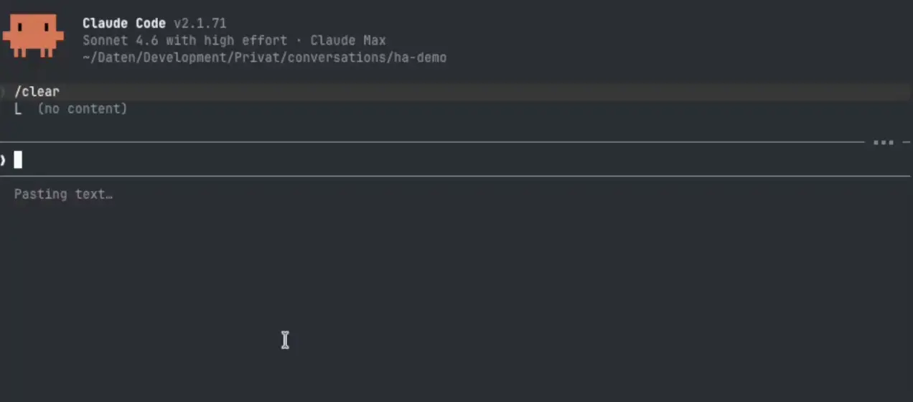
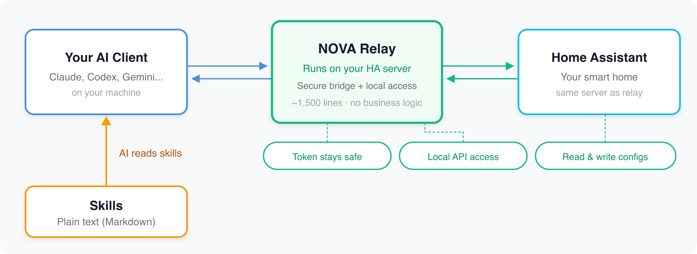

<p align="center">
  <a href="https://github.com/markusleben/ha-nova/actions/workflows/ci.yml"></a>
  <a href="https://github.com/markusleben/ha-nova/blob/main/LICENSE"></a>
  = 20">
  
</p>

## What is HA NOVA?

HA NOVA gives your AI a way to actually work with Home Assistant AND without randomly breaking things.

Here's the problem: let an AI agent loose on your smart home and it'll happily create, change, or delete stuff without thinking twice. HA NOVA stops that. Every risky change goes through a clear path: research first, preview what's about to happen, apply it, then check if it actually worked.

The brain of the whole thing? Plain markdown files called *skills*. They tell the AI how Home Assistant works, what to watch out for, and how to do things properly. No code. Just text files.

Then there's the *relay* — a small app running directly on your Home Assistant server. Think of it as the quiet helper in the background. It keeps your token safe on the server (never on your machine), handles WebSocket stuff, and does the things that only work when you're actually on the HA host. It stays small on purpose. The intelligence lives in the skills, not in the relay.

A setup wizard handles the installation. Pick your AI client, follow the prompts, done.

Works with **Claude Desktop, Claude Code, Codex CLI, OpenCode, and Gemini CLI**.

> **Early Access:** The core works well, but expect some rough edges. macOS only for now (Linux/Windows coming). Back up your configs before letting AI touch anything. Hit a problem? [Open an issue](https://github.com/markusleben/ha-nova/issues).

### See it in action



> *"When I get home, set the living room lights to a warm welcome ambiance"* — one sentence in, a fully reviewed automation out, including suggestions you might not have thought of.

## 🚀 Quick Start

> **You need:** macOS, [Node.js 20+](https://nodejs.org), Home Assistant OS or Supervised

```bash
curl -fsSL https://raw.githubusercontent.com/markusleben/ha-nova/main/install.sh | bash
```

The wizard handles relay, tokens, skills — everything. Just pick your AI client. Once it's done, open your client and try: *"Show me all my automations."*

**Cloned the repo manually?** `./scripts/onboarding/bin/ha-nova setup` | **Something broken?** `ha-nova doctor`

## 💬 What Can You Do?

Automation and script changes follow a four-step safety flow:

1. **Research:** Finds your devices, checks existing configs, resolves the right entity IDs
2. **Preview:** Shows you exactly what will be written. Nothing happens until you say OK.
3. **Apply & Verify:** Writes it, reads it back, makes sure it actually stuck
4. **Review:** Checks the result against 40+ rules for common mistakes, conflicts, and reliability issues

Simple stuff like turning on a light? That stays lightweight. But anything that touches your config goes through the full flow. No guessed entity IDs, no random writes, no surprises.

Deleting anything requires a confirmation code. Not just "yes" — an actual code. Because "yes" is too easy to say.

| You say | What happens |
|---------|-------------|
| *"Turn on the porch light at sunset and off at 11 PM"* | Creates a fully reviewed automation through the safety flow |
| *"Why didn't my motion automation trigger last night?"* | Digs into the actual trace logs and explains what went wrong |
| *"Check my automations for problems"* | Runs a full config audit across your setup |
| *"Turn off the living room lights"* | Turns it off, confirms the new state |
| *"Show me all sensors in the bedroom"* | Finds entities by room, area, or name |
| *"Create a counter helper for my coffee intake"* | Creates the helper, shows the result |

## ⚙️ How It Works

<p align="center">
  
</p>

**The Skills** are plain text files on your machine. Rules, logic, workflows — all in markdown. Your AI loads only the skill it needs for the current task. Want to teach it something new? Write a markdown file. No code, no compilation, no deployment. That's it.

**The Relay** runs on your Home Assistant server. It keeps your access token where it belongs — on the server, not on your laptop — and handles the things that only work with direct host access. WebSocket features today, maybe safe backup flows later. It stays small on purpose. The relay is the hands. The skills are the brain.

### 📊 How does this compare to MCP servers?

| | MCP Servers | HA NOVA |
|---|---|---|
| 🔌 **Connectivity** | Tools call HA API directly | Relay on HA server (API + local file access) |
| 🧠 **Knowledge** | In tool code + optional resources | In modular markdown skills |
| 📦 **Context** | Tools loaded at startup | Only relevant skill loaded per task |
| 🔧 **Extending** | Write code, deploy | Edit a markdown file |
| 🛡️ **Safety** | Per-tool (annotations, confirm flags) | 4-phase: research → preview → apply → review |
| 🖥️ **Clients** | Any MCP-compatible client | 5 tested clients |

Both approaches work. MCP servers have broader client support out of the box. HA NOVA trades that for simplicity — adding a new capability means editing a text file instead of writing and deploying code. Different trade-off, not better or worse.

**Can't I just call the HA API directly?** Sure. But HA NOVA adds a guided safety layer on top, plus a relay on the HA side for things where host access actually matters.

## 🧩 Skills

| Skill ID | What it does |
|-------|-------------|
| ✏️ **ha-nova-write** | Create, update, delete automations and scripts through the 4-phase safety flow |
| 📖 **ha-nova-read** | Browse configs, inspect automations, debug with trace analysis |
| 🔍 **ha-nova-review** | Audit for 40+ common mistakes, conflicts, and best-practice violations |
| 🎛️ **ha-nova-service-call** | Control devices: lights, climate, covers, switches, media players |
| 🔎 **ha-nova-entity-discovery** | Find entities by name, room, or area |
| 🧩 **ha-nova-helper** | Manage helpers (input_boolean, counter, timer, schedule, and more) |
| 🛡️ **ha-nova-fallback** | Safety fallback for dashboards, blueprints, energy, areas, and other relay-ready features |
| 🚀 **ha-nova-onboarding** | Setup diagnostics and troubleshooting |

Want to add a new capability? → [CONTRIBUTING.md](CONTRIBUTING.md)

## 🛡️ Safety

- **Preview first:** every change is shown before it happens
- **Confirmation codes:** deletes need a specific code, not just "yes"
- **Post-write review:** after every change, the AI checks for mistakes and conflicts
- **Token isolation:** your HA token stays on the server, never on your machine
- **Encrypted auth:** client-side credentials in macOS Keychain, not in config files
- **Your network, your data:** no cloud dependency, no tracking (your AI client's own cloud usage is separate)

## 🖥️ Supported AI Clients

| Client | Type |
|--------|------|
| [Claude Desktop](https://claude.com/download) (Code tab) | Desktop app |
| [Claude Code](https://github.com/anthropics/claude-code) | Terminal |
| [Codex CLI](https://github.com/openai/codex) | Terminal |
| [OpenCode](https://github.com/nicepkg/OpenCode) | Terminal |
| [Gemini CLI](https://github.com/google-gemini/gemini-cli) | Terminal |

> **Not a terminal person?** Claude Desktop gives you the same capabilities in a graphical chat interface:
> 1. Run the install command and select "Claude Code" (they share the same config)
> 2. Open Claude Desktop and switch to the **Code** tab
> 3. Pick any folder on your Mac as workspace and start talking

## 🤝 Contributing

HA NOVA is early. Good time to help shape it.

- **Write a skill:** just a markdown file, no code needed
- **Test on your setup:** find what works, report what doesn't
- **Tackle an [open issue](https://github.com/markusleben/ha-nova/issues)**

→ [CONTRIBUTING.md](CONTRIBUTING.md) for details

## 📖 The Story Behind It

I spent over a year building an MCP server for Home Assistant. Hundreds of tool definitions, thousands of lines of code. I kept polishing, kept adding features, never releasing. By the time I looked up, others had shipped theirs while mine was still sitting on my machine.

**[Here's an early demo](https://youtu.be/ylak867RkzM)** from that time.

Then it hit me! The whole approach was wrong. Instead of encoding everything into a server, I could just... write it down. Plain text that the AI reads directly. I scrapped everything and started fresh.

HA NOVA is what came out of that.

## 📁 Project Structure

```
nova/        Relay app (runs on your HA server)
skills/      AI skills (markdown files)
scripts/     Setup, deploy, diagnostics
tests/       Test suite
```

## 📄 License

[MIT](LICENSE)

## 🙏 Acknowledgments

Some Home Assistant safety-rule ideas in HA NOVA were inspired by [HALMark](https://github.com/nathan-curtis/HALMark) by Nathan Curtis.

Automation best-practice patterns, helper selection guidance, and Zigbee device-control patterns were adapted from [homeassistant-ai/skills](https://github.com/homeassistant-ai/skills) by Sergey Kadentsev ([@sergeykad](https://github.com/sergeykad)) and Julien Lapointe ([@julienld](https://github.com/julienld)).
