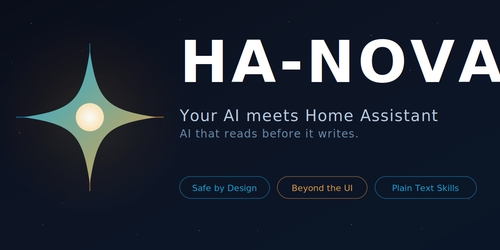

<p align="center">
  
</p>

<p align="center">
  <a href="https://github.com/markusleben/ha-nova/actions/workflows/ci.yml"></a>
  <a href="https://www.npmjs.com/package/ha-nova"></a>
  <a href="https://github.com/markusleben/ha-nova/blob/main/LICENSE"></a>
  = 20">
  
</p>

---

## What Can You Do?

| You Say | What Happens |
|---------|-------------|
| "Turn off the living room lights" | Calls `light.turn_off` via relay |
| "List my automations" | Reads automation registry |
| "Create an automation that turns on the porch light at sunset" | Builds config, previews, asks confirmation, applies |
| "Why didn't my motion automation trigger last night?" | Fetches traces, analyzes trigger/condition/action nodes |
| "Show me all sensors in the bedroom" | Discovers entities by area with device fallback |
| "Set the thermostat to 21°C" | Calls `climate.set_temperature` with verification |

## How It Works

```
┌─────────────────┐     ┌──────────────────┐     ┌──────────────────┐
│   AI Client     │     │   HA NOVA Relay   │     │ Home Assistant   │
│                 │     │   (HA App)        │     │                  │
│  Your AI Client │────▶│  Pure proxy       │────▶│  WebSocket API   │
│  (see below)    │     │  ~2K LOC          │     │  REST API        │
│                 │     │  No business logic│     │                  │
└─────────────────┘     └──────────────────┘     └──────────────────┘
        │
        │ reads
        ▼
┌─────────────────┐
│   LLM Skills    │
│   (Markdown)    │
│                 │
│  7 skill files  │
│  teach your AI  │
│  how to operate │
│  Home Assistant  │
└─────────────────┘
```

HA NOVA is **not** an MCP server. It's a two-part system:

- **Relay** — A tiny HA App that proxies WebSocket and REST calls. No business logic, no tool definitions. Just a secure bridge.
- **Skills** — Markdown files that teach your AI client how to operate Home Assistant. Your AI reads them, understands the API, and acts.

## Why This Approach?

| | Traditional MCP Servers | HA NOVA |
|---|---|---|
| Server code | 10K–88K LOC | ~2K LOC relay |
| Business logic | Hardcoded in server | In LLM skills (Markdown) |
| Adding features | Redeploy server code | Update a text file |
| AI integration | MCP protocol required | Native AI client skills |
| Cloud dependency | Varies | None — fully local |
| Safety model | Varies | 3-phase write with preview + verification |

## Quick Start

> **Requirements:** macOS, Node.js >= 20, Home Assistant OS or Supervised

```bash
npx ha-nova setup
```

The wizard asks which AI client you use, then handles everything: relay installation, token configuration, and skill setup.

## Supported AI Clients

| Client | Status |
|--------|--------|
| [Claude Code](https://github.com/anthropics/claude-code) | Supported |
| [Codex CLI](https://github.com/openai/codex) | Supported |
| [OpenCode](https://github.com/nicepkg/OpenCode) | Supported |
| [Gemini CLI](https://github.com/google-gemini/gemini-cli) | Supported |

## Skills Overview

All skills are nested under `ha-nova/` using the `ha-nova:<skill>` naming convention:

| Skill | What It Does |
|-------|-------------|
| **ha-nova:write** | Create, update, delete automations and scripts — 3-phase safety flow (Resolve → Preview → Apply) |
| **ha-nova:read** | List configs, inspect automations/scripts, debug with trace analysis |
| **ha-nova:entity-discovery** | Search entities by name, domain, room, or area |
| **ha-nova:service-call** | Direct device control (lights, climate, covers, switches, etc.) |
| **ha-nova:review** | Analyze automations/scripts for best-practice violations and conflicts |
| **ha-nova:onboarding** | Guided setup diagnostics and troubleshooting |

## Safety

Every write goes through three phases:

1. **Resolve** — Read-only agent finds entities, checks config, scores candidates
2. **Preview** — Shows you exactly what will change, asks for confirmation
3. **Apply** — Writes config, reloads, reads back to verify

Additional safeguards:
- Delete requires tokenized confirmation (`confirm:tok-...`)
- Best-practice gate for complex automations
- All auth via macOS Keychain — tokens never appear in prompts
- Agents restricted to relay API only — no direct HA access
- No cloud, no telemetry, fully local

## Troubleshooting

```bash
npx ha-nova doctor
```

## Architecture

```
src/                    Relay server (TypeScript)
skills/                 LLM skills (flat layout — context skill + 6 sub-skills)
  ha-nova/              Context skill (auto-loaded) + reference docs + agent templates
scripts/onboarding/     Setup wizard and diagnostics
.claude-plugin/         Claude Code plugin manifest
```

## Contributing

See [CONTRIBUTING.md](CONTRIBUTING.md).

## License

[MIT](LICENSE)
