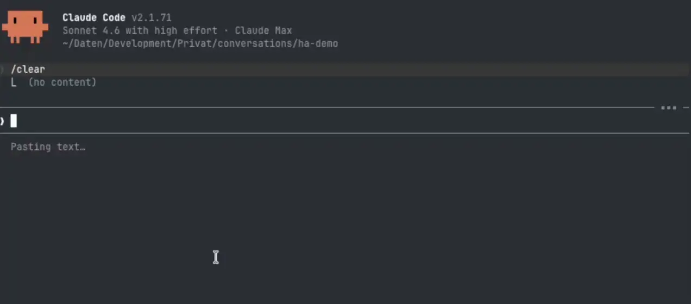
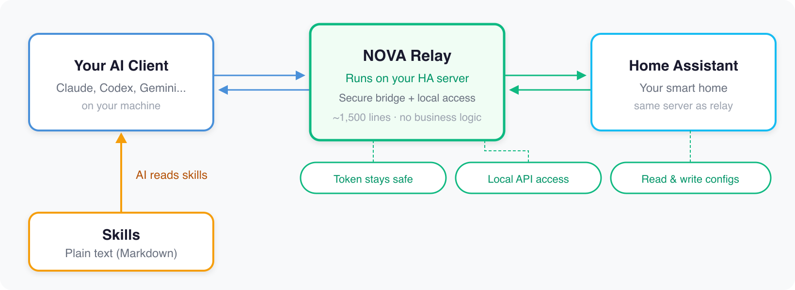

  
  
  

<h2 align="center">AI that checks its work before touching your Home Assistant</h2>

  Preview changes before they're written. Catch mistakes automatically. 
  Your Home Assistant token stays on the server.

  Works with <b>Claude Code</b> · <b>Claude Desktop</b> · <b>Codex CLI</b> · <b>OpenCode</b> · <b>Google Antigravity</b> · <b>Hermes Agent</b> (preview)

  

> *"When I get home, set my main lights to a warm welcome scene"* — one sentence in, a fully reviewed automation out, including suggestions you might not have thought of.

  <b><a href="#-what-you-can-do">What it does</a></b> · <b><a href="#%EF%B8%8F-safe-by-design">Is it safe?</a></b> · <b><a href="#-get-started">Get started</a></b> · <b><a href="#-how-it-works">How it works</a></b>

> **Early access.** The core works, and this is a good time to help shape the product. Back up your configs before letting AI touch anything. Hit a problem? [Open an issue](https://github.com/markusleben/ha-nova/issues).

---

## 💬 What You Can Do

Say what you want. HA NOVA figures out the rest.

| You say | What happens |
|:--------|:-------------|
| *"Check my automations for problems"* | Audits against 40+ rules — catches conflicts, dead triggers, and mistakes you'd never spot manually |
| *"Why didn't my motion light trigger last night?"* | Replays the actual trace and tells you exactly where it failed and why |
| *"Turn on the porch light at sunset and off at 11 PM"* | Builds, previews, and reviews the automation before it touches your config |
| *"What happened to my living room temperature overnight?"* | Pulls history and summarizes the timeline in plain language |
| *"Add a weather card to my main dashboard"* | Reads the dashboard, shows the change, writes only after you confirm |
| *"Move all kitchen devices to the Kitchen area"* | Reassigns entities and devices — shows what will change first |
| *"Turn off the upstairs lights"* | Turns them off, confirms the new state |
| *"Show me all temperature sensors"* | Finds entities by name, room, area, or label |

> Automations and scripts get the full workflow today: preview, review, and a 40+ rule audit. Helpers, dashboards, and device control get preview-and-verify — deeper audits are rolling out with every release.

---

## 🛡️ Safe by Design

We built this because we didn't trust AI with our own config either.

**What happens when AI wants to change something:**

1. **Researches first.** Finds your devices, checks your setup, resolves entity names. No guessing.
2. **Shows you the change.** Full diff, before anything is written.
3. **You approve it.** Deletes require a specific confirmation code — not just "yes."
4. **Writes and verifies.** Reads the config back to confirm the change stuck.
5. **Audits itself.** Checks for mistakes, conflicts, and reliability issues.
6. **Lets you take it back.** Reply `revert` to undo the latest verified update. New items are removed through the same preview-and-confirm delete flow.

**The ground rules — always:**

- 🔒 Your Home Assistant token stays on your server. The AI never sees it.
- 🔑 The local Relay token uses OS secure storage by default, with documented service-mode exceptions.
- 📖 Every rule the AI follows is a markdown file you can read.
- 🏠 HA NOVA has no cloud relay and no telemetry.

---

## 🚀 Get Started

One installer. One wizard. Done. It even finds your Home Assistant automatically.

> **You need:** Home Assistant OS or Supervised.

1. Open the [latest release](https://github.com/markusleben/ha-nova/releases/latest)
2. Copy the one-liner for your OS
3. Run it — the wizard discovers your HA, sets up the connection, and configures your AI client

Once it finishes, try: *"Show me all my automations."*

<strong>Platform notes</strong>

 

**macOS** — fully tested on real hardware.

**Linux** — same installer, passes automated checks. Real-machine testing is ongoing.

**Windows** — ships x64 builds (Windows ARM64 can use the x64 build through emulation; no native ARM64 bundle is shipped).
- Claude Code is the most tested client on Windows today
- Google Antigravity has basic validation
- Codex and OpenCode are still early
- Native prerequisites: Claude Code needs Git for Windows / Git Bash; Google Antigravity Desktop or CLI must be installed
- See [.claude/INSTALL.md](.claude/INSTALL.md) and [.antigravity/INSTALL.md](.antigravity/INSTALL.md)

> Do not download the `ha-nova-installer-bundle-*.tar.gz` / `.zip` assets manually. Those archives are used by the installer behind the scenes. Always use the one-liner or `ha-nova update`.

<strong>CLI commands & legacy uninstall</strong>

 

| Command | What it does |
|:--------|:-------------|
| `ha-nova check-update` | Check for newer versions |
| `ha-nova update` | Update to the latest release |
| `ha-nova setup` | Re-run the setup wizard |
| `ha-nova doctor` | Diagnose connection and config problems |
| `ha-nova uninstall` | Remove HA NOVA (keeps settings for easy reinstall) |
| `ha-nova uninstall --purge` | Full cleanup including saved settings |

**Coming from a pre-Go install?**
- macOS / Linux: `curl -fsSL https://raw.githubusercontent.com/markusleben/ha-nova/main/scripts/legacy-uninstall.sh | bash`
- Windows: `irm https://raw.githubusercontent.com/markusleben/ha-nova/main/scripts/legacy-uninstall.ps1 | iex`

> **Not a terminal person?** Initial install uses one terminal command; after setup, Claude Desktop and Google Antigravity Desktop give you the same skills in an app window.

---

## ⚙️ How It Works

  

**Skills** live on your machine as plain markdown. They're the AI's playbook — what to check, what to show you first, what to verify after a change. You can open them, read them, even edit them.

**The Relay** lives on your Home Assistant server. It's the only part that talks to Home Assistant directly, and it keeps your access token there — never on your laptop, never in a prompt.

Most new HA NOVA workflows are text-file skill updates on your machine. When a workflow needs a new transport capability, the Relay changes only at that transport boundary and still does not learn Home Assistant business logic.

And because the Relay sits right next to Home Assistant, it can do things a remote client can't — like snapshotting an automation before it updates it, so you can revert the latest verified update with a single word. For deletes or point-in-time recovery, use a suitable Home Assistant Backup or recreate the item.

---

## 🔮 What's Next

HA NOVA is early — and that's the point. Here's where it's going:

- **Deeper reviews everywhere** — the full 40+ rule audit, expanding beyond automations
- **Community skills** — write a new workflow as a markdown file, share it with everyone
- **Broader platform testing** — real-machine coverage for Linux and Windows ARM

> If you've ever wanted to shape how AI works with Home Assistant, this is the stage where your input actually changes the product.

---

## 🧩 Skills

17 task skills plus the HA NOVA context skill, each a markdown file you can read and edit.

| Skill | What it does |
|:------|:-------------|
| ✏️ **write** | Build and change automations with full preview and safety checks |
| 📖 **read** | Inspect configs and debug why an automation didn't fire |
| 🔍 **review** | Audit your setup for mistakes, conflicts, and reliability gaps |
| 🧱 **dashboard** | Edit dashboards, cards, and Lovelace resources safely |
| 🎬 **scene** | Create and manage scenes, including "save this room as a scene" |
| 🗂️ **organize** | Manage areas, floors, labels, and entity metadata |
| 🕒 **history** | Query history, logbook timelines, and long-term stats |
| 🏠 **health** | Summarize Home Assistant status, repairs, integrations, system health, and noisy entities |
| 📅 **calendar** | Read calendars and bounded event windows |
| ✅ **todo** | Manage to-do and shopping-list items, create Local To-do lists |
| 💾 **backup** | Check backup status, create backups — also as a safety net before risky changes |
| ⬆️ **updates** | See pending updates, read release notes, and install them with safety gates |
| 🎛️ **service-call** | Control lights, climate, covers, switches, and media players |
| 🔎 **entity-discovery** | Find entities by name, room, area, or label |
| 🧩 **helper** | Create and manage helpers: counters, timers, template sensors, and more |
| 🛡️ **fallback** | Safety net for blueprints, zones, energy, and advanced ops |
| 🚀 **onboarding** | Diagnose setup issues and troubleshoot connections |

Want to add a new capability? → [CONTRIBUTING.md](CONTRIBUTING.md)

The skills declare the NOVA Relay version they need (see `version.json`) and warn at runtime when the installed relay app is older — update it in Home Assistant under **Settings > Apps > NOVA Relay**.

---

## 🖥️ Supported Clients

| Client | Type |
|:-------|:-----|
| [Claude Code](https://github.com/anthropics/claude-code) | Terminal |
| [Claude Desktop](https://claude.com/download) (Code tab) | Desktop app |
| [Codex CLI](https://github.com/openai/codex) | Terminal |
| [OpenCode](https://github.com/opencode-ai/opencode) | Terminal |
| [Google Antigravity](https://antigravity.google/) | Desktop app / Terminal |
| Hermes Agent (preview) | Terminal |

> Google Antigravity is the current Google client path. `ha-nova setup gemini` remains a legacy alias for existing Gemini-era installs.

> **Hermes is in preview.** The Linux desktop route (GNOME Keyring) is maintainer-validated; macOS and Windows-via-WSL2 are experimental, and native Windows isn't supported. Details: [.hermes/INSTALL.md](.hermes/INSTALL.md).

---

## 🤝 Contributing

This is the best time to get involved.

- **Write a skill** — add a new workflow in markdown, no server code needed
- **Test on your setup** — edge cases from real installs make everything better
- **Improve docs** — make HA NOVA clearer for the next person
- **Tackle an [open issue](https://github.com/markusleben/ha-nova/issues)** — especially if you want a workflow to become first-class

→ [CONTRIBUTING.md](CONTRIBUTING.md)

---

## 📖 The Story

I spent over a year building an 88K-line MCP server for Home Assistant. Kept adding features, never releasing. Others shipped theirs while mine sat on my machine.

Then I realized the architecture was the problem. Instead of burying HA knowledge in a huge server, I could keep the server lean and write the workflows as plain text — readable, editable, and much easier to grow with other people.

HA NOVA is what came out of that. **[Here's an early demo](https://youtu.be/ylak867RkzM)** from the MCP era.

---

## 📄 License

[MIT](LICENSE)

## 🙏 Acknowledgments

Safety-rule ideas inspired by [HALMark](https://github.com/nathan-curtis/HALMark) by Nathan Curtis. Automation patterns, helper guidance, and device-control patterns adapted from [homeassistant-ai/skills](https://github.com/homeassistant-ai/skills) by Sergey Kadentsev ([@sergeykad](https://github.com/sergeykad)) and Julien Lapointe ([@julienld](https://github.com/julienld)).
